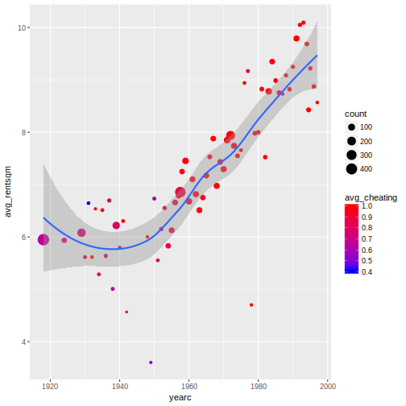

Here's a plot made using the Munich rent dataset. It was made to explore the questions "how has the rent in Munich changed (from 1920 to 1990)" and "how does the proportion of centrally heated appartments change in time".


```r
library(tidyverse)
library(gamlss.data)

df <- rent99

rent_by_year <- summarise(group_by(df, yearc),
                          count=n(),
                          avg_rent=mean(rent, na.rm=TRUE),
                          avg_cheating=mean(as.numeric(cheating)-1, na.rm=TRUE))

ggplot(rent_by_year, aes(yearc, avg_rent)) +
  geom_point(aes(size=count,color=avg_cheating)) +
  geom_smooth() +
  scale_colour_gradient(low="#0000FF", high="#FF0000") 
```



In the above plot, larger circles mean more rented appartments were registered in that year (meaning the average is computed for a larger n) and we therefore expect them to be closer to the true average for the given year. Smaller circles are less robust / more affected by variance. The general trend seems to be that rent decreased after WWI throughout WWII and has since increased. Almost all rented appartments after 1955 are centrally heated.
